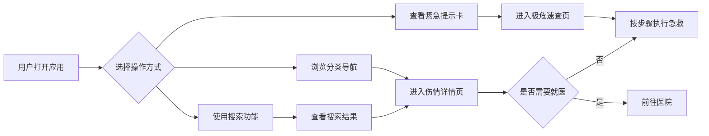
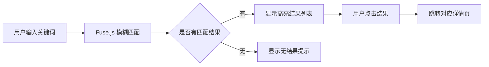

# 外伤急救速查 - 产品需求文档（PRD）

## 1. 产品概述

**外伤急救速查**是一款即开即用的外伤处理知识工具，帮助非专业人员在意外发生时快速找到正确、简洁的处理步骤，避免错误操作加重伤情。产品覆盖六大常见伤情类型，提供紧急情况速查、分类导航、实时搜索等功能，支持离线访问，适用于普通家庭、户外运动爱好者等需要快速获取急救信息的场景。

- **核心价值**：在紧急情况下提供可信赖、易操作的外伤急救指导
- **目标用户**：普通家庭（尤其有老人/儿童）、户外运动爱好者、需要离线查阅的任何人

## 2. 核心功能

### 2.1 用户角色

| 角色 | 注册方式 | 核心权限 |
|------|----------|----------|
| 普通用户 | 无需注册 | 浏览全部内容、搜索、离线使用 |

### 2.2 功能模块

1. **首页**：紧急提示卡、搜索入口、六大伤情分类导航
2. **详情页**：每种伤情的处理步骤、禁忌事项、就医指征
3. **搜索页**：关键词模糊匹配与结果预览
4. **极危速查页**：严重出血、心脏骤停等危急情况的通用处理原则
5. **关于与免责页**：内容来源说明、免责声明全文

### 2.3 页面详情

| 页面名称 | 模块名称 | 功能描述 |
|-----------|----------|----------|
| 首页 | 紧急提示卡 | 顶部常驻红色警示卡片，展示"严重出血""心脏骤停"等极危情况及通用处理原则，点击可展开完整步骤 |
| 首页 | 搜索框 | 全局搜索入口，输入关键词模糊匹配标题与症状，支持即时预览跳转 |
| 首页 | 分类导航网格 | 6个图文卡片（擦伤/割伤🩹、烧烫伤🔥、扭伤/骨折🦴、动物咬伤🐕、异物入眼👁️、冻伤❄️），点击进入对应详情页 |
| 首页 | 免责入口 | 底部固定链接至关于与免责页面 |
| 详情页 | 处理步骤区 | 编号列表形式呈现可直接执行的操作步骤，每步配有简要说明 |
| 详情页 | 禁忌事项区 | 红色警告样式突出显示禁止操作，防止错误处理 |
| 详情页 | 就医指征区 | 列出必须立即就医的情况判断标准 |
| 详情页 | 固定免责提示 | 底部常驻免责声明摘要链接 |
| 搜索结果页 | 结果列表 | 关键词高亮显示的匹配结果列表，点击直接跳转对应详情页 |
| 极危速查页 | 危急情况卡片 | 严重出血、心脏骤停、气道梗阻等核心急救步骤，大字体高对比度设计 |
| 关于与免责页 | 内容说明 | 数据来源、更新机制、完整免责声明文本 |

## 3. 核心流程

### 用户主要使用流程

用户打开应用 → 在首页浏览紧急提示或使用搜索框 → 点击分类卡片进入详情 → 查看处理步骤和禁忌 → 根据指引进行急救操作或决定就医

### 搜索流程

## 4. 用户界面设计

### 4.1 设计风格

- **主色调**：急救红 `#DC2626` 作为警示色，深青色 `#0F766E` 作为医疗专业感辅助色，米白 `#FFFBEB` 作为背景底色营造温暖安全感
- **辅助色**：警告橙 `#EA580C` 用于禁忌事项，安全绿 `#059669` 用于正确操作指示
- **按钮风格**：圆角胶囊形按钮（border-radius: 9999px），带微妙阴影和按压反馈效果
- **字体选择**：
  - 标题字体：`Noto Sans SC`（中文）+ `Outfit`（英文数字），现代感强且清晰易读
  - 正文字体：`Noto Sans SC` 统一，确保移动端中文阅读体验
  - 紧急内容采用加粗大字号（24px+）保证紧急情况下快速识别
- **布局风格**：卡片式布局为主，信息层级通过卡片阴影和间距区分；移动端优先的单列布局，桌面端自适应为双列网格
- **图标风格**：Emoji 图标配合简洁 SVG 线性图标，亲和力强且无需额外资源加载

### 4.2 页面设计概览

| 页面名称 | 模块名称 | UI 元素描述 |
|-----------|----------|-------------|
| 首页 | 顶部区域 | 品牌Logo + 应用名称「外伤急救速查」，副标题「关键时刻的正确指引」 |
| 首页 | 紧急提示卡 | 渐变红背景（#DC2626 → #B91C1C），白色文字，脉冲动画吸引注意，内含2-3条极危情况摘要 |
| 首页 | 搜索框 | 圆角输入框，占位符「搜索伤情或症状...」，右侧搜索图标，聚焦时边框变为急救红 |
| 首页 | 分类导航 | 2×3 网格布局，每个卡片包含 Emoji 图标 + 分类名称 + 简短描述，悬停时上浮阴影加深 |
| 首页 | 底部导航 | 版权信息 + 免责声明链接 + 版本号 |
| 详情页 | 头部 | 返回按钮 + 伤情图标 + 标题，底部渐变分隔线 |
| 详情页 | 步骤区 | 编号圆形徽章（1、2、3...）+ 步骤文字，步骤间用浅灰分割线，当前阅读步骤微高亮 |
| 详情页 | 禁忌区 | 红色左侧边框标识，警告三角形图标前置，列表项前缀 ❌ 符号 |
| 详情页 | 就医指征区 | 橙色左侧边框标识，医院图标前置，列表项前缀 ⚠️ 符号 |
| 搜索结果页 | 结果项 | 匹配关键词黄色高亮（#FEF08A），显示所属分类标签，箭头指示可点击 |
| 极危速查页 | 场景卡片 | 全宽卡片布局，每个危急场景独立区块，超大字号步骤（20px+），红色强调关键动作 |
| 关于与免责页 | 内容区 | 居中排版，分段落展示内容来源、数据结构说明、完整免责声明 |

### 4.3 响应式设计

- **桌面端优先**（≥1024px）：双列分类网格，侧边固定导航可选，搜索框居中宽屏展示
- **平板端**（768px-1023px）：单列布局，分类网格保持2列，字体适当缩小
- **移动端**（<768px）：全单列堆叠，触摸友好的44px最小点击区域，底部固定免责入口
- **触控优化**：所有可点击元素至少44×44px触控区域，按钮间距充足防误触

### 4.4 动画与交互

- **入场动画**：页面元素依次淡入上移（staggered reveal），间隔100ms
- **卡片交互**：悬停时 translateY(-4px) + box-shadow 加深，过渡时间200ms ease
- **紧急卡片**：持续微弱脉冲动画（2s周期）吸引注意力但不造成焦虑
- **页面切换**：路由切换时淡入淡出过渡（300ms）
- **搜索反馈**：输入时 debounce 300ms 后触发搜索，加载时骨架屏或旋转图标
