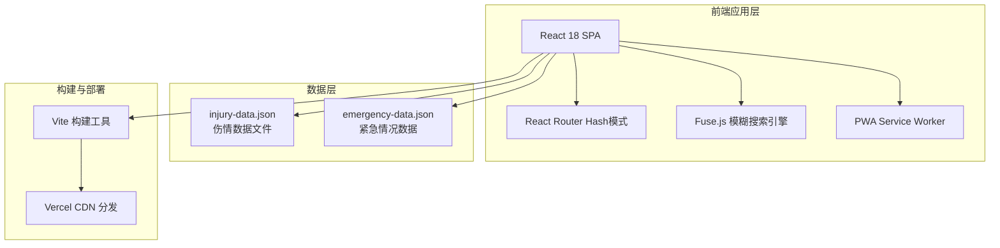
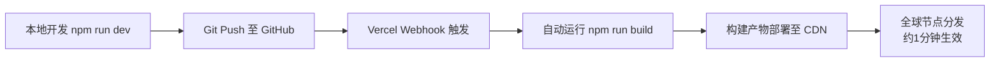

# 外伤急救速查 - 技术架构文档

## 1. 架构设计



**架构特点**：
- 纯前端单页应用，无后端服务依赖
- 所有数据以 JSON 格式内置在前端代码中
- 通过 Hash 路由实现多视图切换，兼容静态托管
- PWA 支持离线缓存，适合应急场景使用

## 2. 技术选型

| 技术领域 | 选型方案 | 版本 | 说明 |
|----------|----------|------|------|
| 前端框架 | React | 18.x | 组件化开发，生态成熟 |
| 构建工具 | Vite | 5.x | 快速冷启动，HMR体验优秀 |
| 路由管理 | React Router DOM | 6.x | Hash模式，无需服务端配置 |
| 搜索引擎 | Fuse.js | 7.x | 轻量级前端模糊搜索 |
| CSS方案 | Tailwind CSS | 3.x | 原子化CSS，快速迭代样式 |
| PWA支持 | vite-plugin-pwa | 0.x | 自动生成Service Worker |
| 部署平台 | Vercel | - | Git推送自动构建部署 |
| 包管理器 | npm / pnpm | - | 推荐pnpm以提升安装速度 |

## 3. 路由定义

| 路由路径 | 页面名称 | 对应组件 | 说明 |
|----------|----------|----------|------|
| `/` | 首页 | HomePage | 搜索框、紧急提示卡、分类导航 |
| `/search` | 搜索结果 | SearchPage | 关键词高亮的结果列表 |
| `/injury/cut` | 擦伤/割伤详情 | InjuryDetailPage | id参数: cut |
| `/injury/burn` | 烧烫伤详情 | InjuryDetailPage | id参数: burn |
| `/injury/sprain` | 扭伤/骨折详情 | InjuryDetailPage | id参数: sprain |
| `/injury/bite` | 动物咬伤详情 | InjuryDetailPage | id参数: bite |
| `/injury/eye` | 异物入眼详情 | InjuryDetailPage | id参数: eye |
| `/injury/frostbite` | 冻伤详情 | InjuryDetailPage | id参数: frostbite |
| `/emergency` | 极危情况速查 | EmergencyPage | 严重出血、心肺复苏等 |
| `/about` | 关于与免责 | AboutPage | 内容来源、免责声明 |

**路由配置示例**：

```typescript
// 使用 React Router v6 HashRouter
const routes = [
  { path: '/', element: <HomePage /> },
  { path: '/search', element: <SearchPage /> },
  { path: '/injury/:id', element: <InjuryDetailPage /> },
  { path: '/emergency', element: <EmergencyPage /> },
  { path: '/about', element: <AboutPage /> },
];
```

## 4. 数据模型

### 4.1 伤情数据结构 (InjuryData)

```typescript
interface InjuryData {
  id: string;                    // 唯一标识，如 'burn', 'cut'
  title: string;                 // 伤情标题，如 '烧烫伤'
  icon: string;                  // Emoji图标，如 '🔥'
  description: string;           // 简短描述（用于卡片展示）
  keywords: string[];            // 搜索关键词数组
  steps: string[];               // 处理步骤（编号列表）
  warnings: string[];            // 禁忌事项（红色警告）
  whenToSeeDoctor: string[];     // 必须就医的指征
}
```

### 4.2 紧急情况数据结构 (EmergencyData)

```typescript
interface EmergencyItem {
  id: string;                    // 唯一标识
  title: string;                 // 危急情况名称，如 '严重出血'
  icon: string;                  // Emoji图标
  severity: 'critical' | 'urgent'; // 严重等级
  summary: string;               // 一句话概述
  steps: string[];               // 核心处理步骤
  warning: string;               // 特别注意事项
}
```

### 4.3 六大伤情初始数据

```json
[
  {
    "id": "cut",
    "title": "擦伤/割伤",
    "icon": "🩹",
    "description": "浅表擦伤、较深切割伤、伤口异物的处理方法",
    "keywords": ["擦伤", "割伤", "划伤", "流血", "伤口", "刀伤", "玻璃"],
    "steps": [
      "用清水或生理盐水冲洗伤口及周围皮肤",
      "用碘伏消毒伤口及周围2-3cm范围",
      "浅表小伤口可贴创可贴，较大伤口用无菌纱布覆盖",
      "每日更换敷料，观察伤口愈合情况"
    ],
    "warnings": [
      "不要用酒精直接涂抹开放性伤口（刺激性强）",
      "不要涂抹牙膏、酱油、草药粉末等偏方",
      "不要强行清除嵌入深部的异物",
      "已结痂的伤口不要用手抠挠"
    ],
    "whenToSeeDoctor": [
      "伤口深度超过1厘米或可见脂肪、肌肉层",
      "伤口边缘不齐、无法自行闭合",
      "出血持续压迫10分钟后仍不止",
      "被生锈金属、脏物刺伤（可能需要破伤风针）",
      "伤口出现红肿热痛加剧、流脓等感染迹象"
    ]
  },
  {
    "id": "burn",
    "title": "烧烫伤",
    "icon": "🔥",
    "description": "热液烫伤、火焰烧伤、化学灼伤的处理方法",
    "keywords": ["烫伤", "烧伤", "热水", "蒸汽", "油锅", "火", "化学灼伤"],
    "steps": [
      "冲：用流动冷水冲淋患处至少15-20分钟",
      "脱：在冷水中小心除去衣物，粘连处剪开勿强脱",
      "泡：继续将患处浸泡在冷水中10-20分钟",
      "盖：用干净纱布或无菌敷料轻轻覆盖伤口",
      "送：尽快送往医院或拨打急救电话"
    ],
    "warnings": [
      "不要涂抹牙膏、酱油、食用油、草木灰等偏方",
      "不要刺破水泡",
      "不要用冰块直接冰敷（可能造成冻伤）",
      "化学灼伤先干布擦拭后再冲洗（避免扩大损伤面积）"
    ],
    "whenToSeeDoctor": [
      "烧烫伤面积超过手掌大小",
      "面部、手部、关节、生殖部位烫伤",
      "二度以上烫伤（出现水泡或皮肤发白）",
      "化学灼伤、电击伤",
      "出现休克症状（面色苍白、冷汗、脉搏细弱）"
    ]
  },
  {
    "id": "sprain",
    "title": "扭伤/骨折",
    "icon": "🦴",
    "description": "关节扭伤、疑似骨折、脊柱损伤的处理与搬运禁忌",
    "keywords": ["扭伤", "骨折", "崴脚", "脱臼", "骨裂", "脊柱", "颈椎"],
    "steps": [
      "休息：立即停止活动，避免负重",
      "冰敷：用毛巾包裹冰袋敷于患处，每次15-20分钟",
      "加压：用弹性绷带适度包扎固定（不过紧）",
      "抬高：将受伤肢体抬高至心脏水平以上"
    ],
    "warnings": [
      "疑似骨折时不要尝试复位或强行移动",
      "脊柱/颈部损伤切勿随意搬动患者",
      "不要热敷急性期伤处（48小时内）",
      "不要按摩或揉搓受伤部位"
    ],
    "whenToSeeDoctor": [
      "肢体明显变形、异常活动",
      "无法承重或活动受限严重",
      "剧烈疼痛、肿胀迅速加重",
      "怀疑脊柱或头部损伤",
      "出现麻木、苍白、冰冷等循环障碍表现"
    ]
  },
  {
    "id": "bite",
    "title": "动物/昆虫咬伤",
    "icon": "🐕",
    "description": "狗咬伤、猫抓伤、蛇咬伤、蜂蛰、蜱虫叮咬的处理",
    "keywords": ["狗咬", "猫抓", "蛇咬", "蜂蛰", "蜱虫", "蚊子", "昆虫叮咬"],
    "steps": [
      "狗/猫咬伤：立即用肥皂水和流动清水交替冲洗伤口15分钟",
      "蛇咬伤：保持冷静，制动患肢，用绷带在伤口近心端包扎",
      "蜂蛰：用指甲或银行卡刮除毒刺（勿挤压毒囊），冷水冲洗",
      "蜱虫叮咬：用尖头镊子尽量贴近皮肤夹住蜱虫头部垂直拔出"
    ],
    "warnings": [
      "狗咬伤不要立刻缝合伤口（利于排毒）",
      "蛇咬伤不要用嘴吸吮毒液、不要切开伤口",
      "蜂蛰不要挤压毒囊（会注入更多毒液）",
      "蜱虫不要暴力拽出（可能导致口器残留）",
      "不要忽略任何不明动物咬伤（狂犬病风险）"
    ],
    "whenToSeeDoctor": [
      "任何狗/猫咬伤（必须接种狂犬疫苗）",
      "毒蛇咬伤（需注射抗毒血清）",
      "多处蜂蛰或过敏反应（呼吸困难、全身皮疹）",
      "蜱虫叮咬后出现发热、皮疹（警惕莱姆病）",
      "伤口红肿化脓或出现感染迹象"
    ]
  },
  {
    "id": "eye",
    "title": "异物入眼",
    "icon": "👁️",
    "description": "沙尘、小飞虫、化学液体溅入眼睛的处理方法",
    "keywords": ["眼睛", "异物", "沙子", "飞虫", "化学", "酸碱", "进东西"],
    "steps": [
      "沙尘/飞虫：频繁眨眼尝试利用泪液冲出",
      "提起眼睑，用生理盐水或清洁温水缓慢冲洗眼睛",
      "化学液体：立即大量流动清水冲洗至少15分钟（翻开眼睑）",
      "冲洗后仍感不适，用干净纱布轻轻遮盖双眼"
    ],
    "warnings": [
      "不要揉眼睛（可能划伤角膜）",
      "不要用脏手或纸巾擦拭眼球",
      "化学灼伤不要先滴眼药水再冲洗（应先彻底冲洗）",
      "异物嵌顿不要自行试图取出"
    ],
    "whenToSeeDoctor": [
      "化学液体（尤其是酸碱）溅入",
      "异物感持续超过30分钟无法排出",
      "视力模糊、畏光、流泪不止",
      "眼睛剧烈疼痛或充血严重",
      "尖锐物体穿透或嵌入眼球"
    ]
  },
  {
    "id": "frostbite",
    "title": "冻伤",
    "icon": "❄️",
    "description": "轻度冻伤、严重冻僵、复温注意事项",
    "keywords": ["冻伤", "冻僵", "寒冷", "失温", "手脚冰凉", "发白"],
    "steps": [
      "进入温暖环境，脱去湿冷衣物",
      "轻度冻伤：将患处浸泡在37-40°C温水中（非热水）",
      "用体温复温（如腋下、腹部温暖冻伤部位）",
      "复温后用无菌纱布轻轻包扎保护"
    ],
    "warnings": [
      "不要用雪摩擦冻伤部位（加重组织损伤）",
      "不要用热水或火烤直接复温（可能导致进一步损伤）",
      "严重冻僵不要快速复温（可能导致心律失常）",
      "不要按摩或敲打冻僵部位"
    ],
    "whenToSeeDoctor": [
      "皮肤变硬、变白或变黄（深层组织受损）",
      "大面积冻伤或全身性失温",
      "复温后感觉未恢复或出现水泡",
      "意识模糊、言语不清等失温症状",
      "冻伤部位出现黑紫色或坏死迹象"
    ]
  }
]
```

## 5. 项目目录结构

```
first-aid-quick-ref/
├── public/
│   ├── manifest.json          # PWA manifest
│   ├── icons/                 # PWA图标（192x192, 512x512）
│   └── favicon.ico            # 网站图标
├── src/
│   ├── data/
│   │   ├── injuries.json      # 六大伤情数据
│   │   └── emergency.json     # 紧急情况数据
│   ├── components/
│   │   ├── Layout.jsx         # 公共布局组件（Header/Footer）
│   │   ├── SearchBar.jsx      # 搜索框组件
│   │   ├── EmergencyCard.jsx  # 紧急提示卡组件
│   │   ├── CategoryGrid.jsx   # 分类导航网格组件
│   │   ├── InjuryCard.jsx     # 伤情分类卡片组件
│   │   ├── StepList.jsx       # 处理步骤列表组件
│   │   ├── WarningBox.jsx     # 禁忌事项警告框组件
│   │   └── DoctorTip.jsx      # 就医指征提示组件
│   ├── pages/
│   │   ├── HomePage.jsx       # 首页
│   │   ├── SearchPage.jsx     # 搜索结果页
│   │   ├── InjuryDetailPage.jsx  # 伤情详情页（动态路由）
│   │   ├── EmergencyPage.jsx  # 极危情况速查页
│   │   └── AboutPage.jsx      # 关于与免责页
│   ├── hooks/
│   │   └── useSearch.js       # Fuse.js搜索逻辑Hook
│   ├── App.jsx                # 根组件（路由配置）
│   ├── main.jsx               # 入口文件
│   └── index.css              # 全局样式（Tailwind导入）
├── index.html                 # HTML模板
├── vite.config.js             # Vite配置（含PWA插件）
├── tailwind.config.js         # Tailwind配置
├── postcss.config.js          # PostCSS配置
├── package.json               # 项目依赖
└── README.md                  # 项目说明
```

## 6. 关键技术实现要点

### 6.1 Fuse.js 搜索配置

```javascript
import Fuse from 'fuse.js';

const fuseOptions = {
  keys: [
    { name: 'title', weight: 0.4 },
    { name: 'keywords', weight: 0.3 },
    { name: 'description', weight: 0.2 },
    { name: 'steps', weight: 0.1 }
  ],
  threshold: 0.4,          // 模糊匹配阈值
  includeScore: true,
  includeMatches: true,    // 用于高亮匹配片段
  minMatchCharLength: 2    // 最少输入2字符触发搜索
};
```

### 6.2 PWA 配置 (vite-plugin-pwa)

```javascript
// vite.config.js
import { VitePWA } from 'vite-plugin-pwa';

export default defineConfig({
  plugins: [
    react(),
    VitePWA({
      registerType: 'autoUpdate',
      includeAssets: ['favicon.ico', 'icons/*.png'],
      manifest: {
        name: '外伤急救速查',
        short_name: '急救速查',
        description: '即开即用的外伤处理知识工具',
        theme_color: '#DC2626',
        background_color: '#FFFBEB',
        display: 'standalone',
        icons: [
          { src: '/icons/icon-192.png', sizes: '192x192', type: 'image/png' },
          { src: '/icons/icon-512.png', sizes: '512x512', type: 'image/png' }
        ]
      },
      workbox: {
        globPatterns: ['**/*.{js,css,html,ico,png,svg}']
      }
    })
  ]
});
```

### 6.3 性能优化策略

- **代码分割**：React Router 使用 `lazy` + `Suspense` 实现路由级懒加载
- **数据预取**：首页加载时预加载所有伤情数据（JSON体积小，约5-10KB）
- **搜索防抖**：输入事件 debounce 300ms 后执行搜索，避免频繁计算
- **字体优化**：使用 `font-display: swap` 避免FOIT，中文字体_subset减少体积
- **图片优化**：所有图标使用 Emoji 或内联SVG，零网络请求

## 7. 部署方案

### 7.1 构建与发布流程



### 7.2 环境要求

- Node.js >= 18.x
- npm / pnpm
- GitHub 账户（用于代码托管）
- Vercel 账户（用于自动部署，免费额度足够）

### 7.3 本地开发命令

```bash
# 安装依赖
npm install

# 启动开发服务器（http://localhost:5173）
npm run dev

# 构建生产版本
npm run build

# 预览生产构建
npm run preview
```
